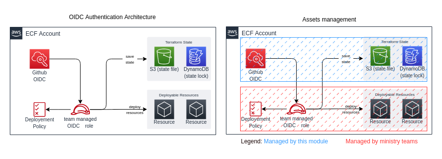

# terraform-octk-aws-oidc-provider

This repository contains the configuration for the Github openID Connect, which allows GitHub action to assume IAM Role in AWS and through them deploy resources.
Also it configures the requirements for terraform deployements using S3 Backend.

## Assets deployed

- AWS Identity provider for Github OpenID Connect
- S3 bucket for terraform state files
- DynamoDB for terraform lock

## Architecture


# Build Steps

1. Get credentials for target AWS root account and apply to current shell (or use AWS profile, etc.). (Note: [this](https://docs.aws.amazon.com/cli/latest/userguide/cli-configure-role.html#cli-configure-role-xaccount) might be helpful if you want to use an IAM user from the master account + cross-account role.

2. Execute Terraform against target account:

```shell script
terraform plan
terraform apply -var="aws_region=<aws_region>" -var="license_plate=<license_plate>" -var="env=<env>"
```
